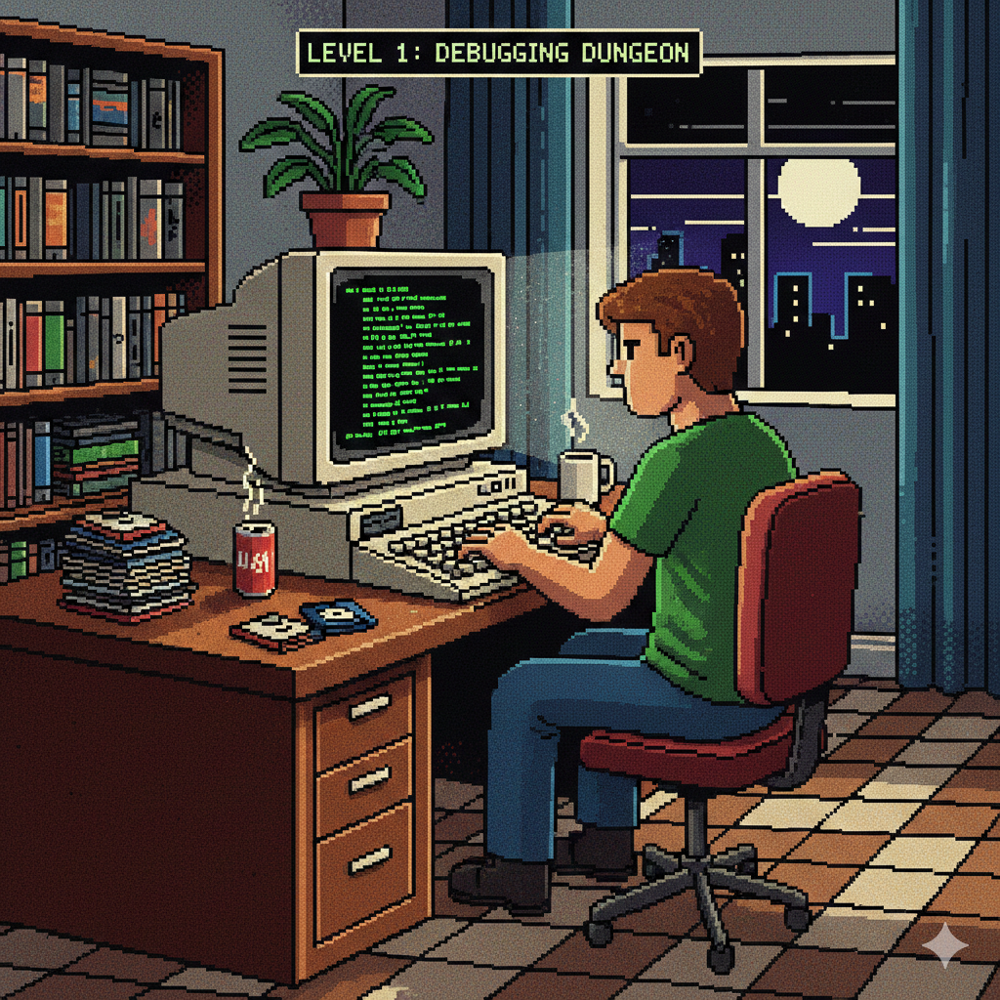
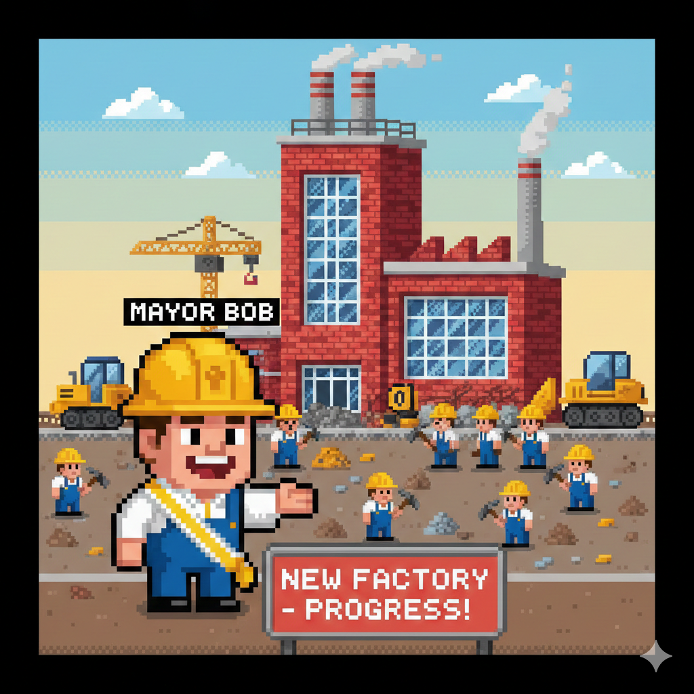
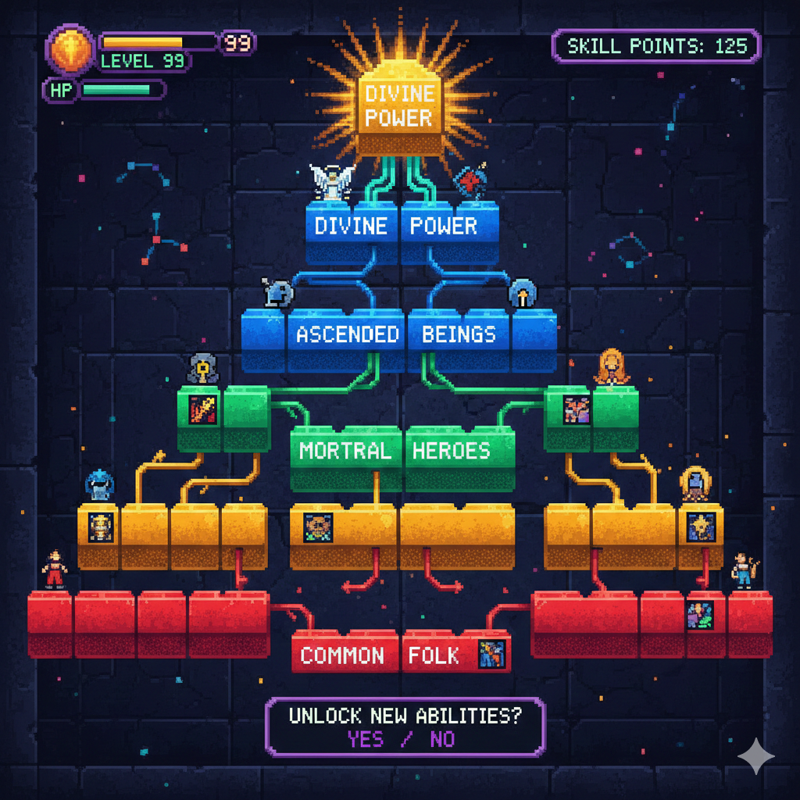
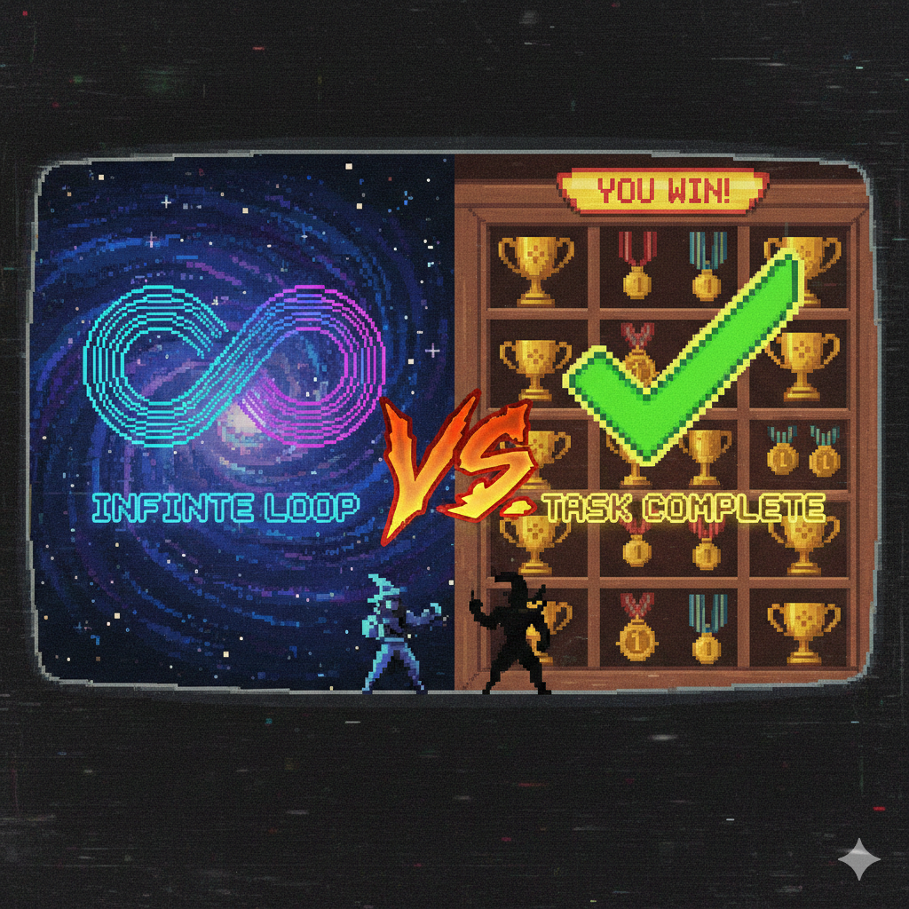
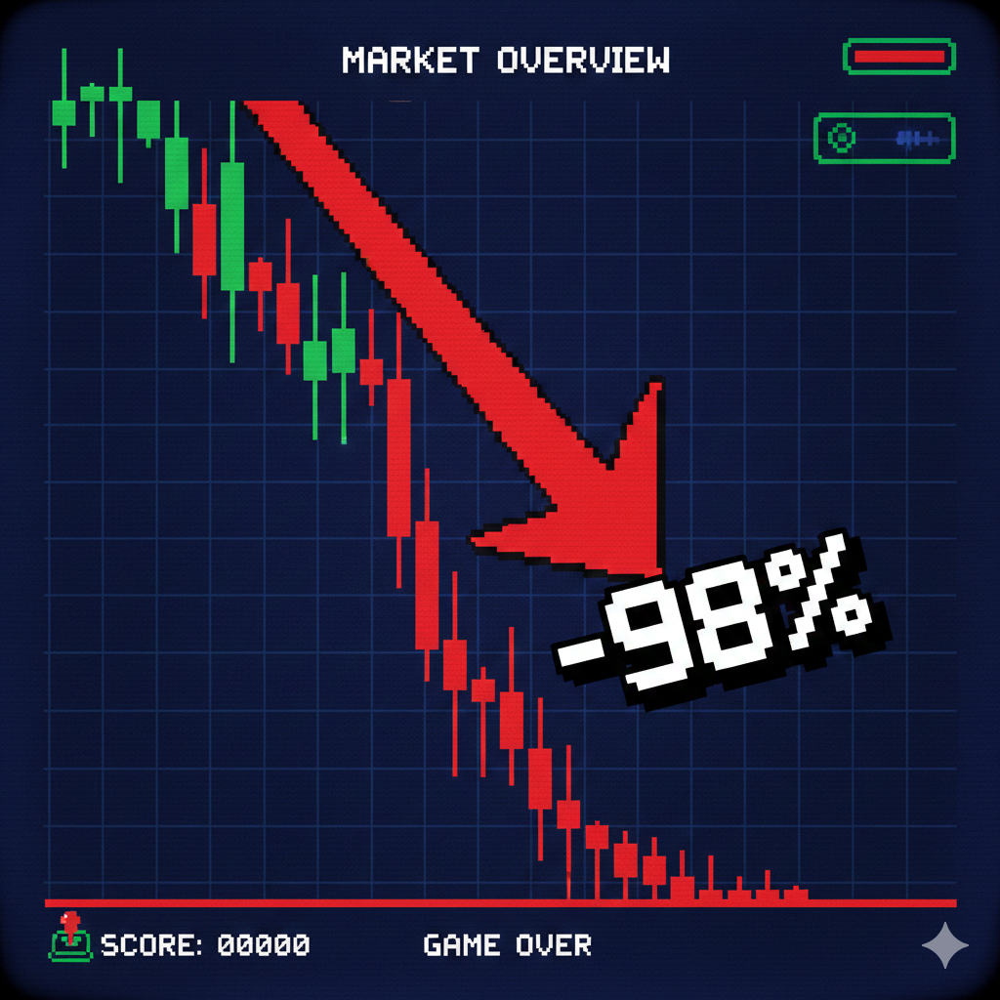

> Steve Yegge花了半年时间，做了4个版本的编排系统，最终在2026年元旦发布了Gas Town。然后，一群他不认识的人给他发了个币。

## 这是个什么东西

2026年1月1日，Steve Yegge在Medium发了篇长文，介绍他做的新项目Gas Town。简单说，这是一个让你同时跑20-30个Claude Code实例的系统。

Steve Yegge是谁？在Amazon干了7年（1998-2005），在Google干了13年（2005-2018），后来去了东南亚的Grab，2022年加入Sourcegraph当工程主管。他最出名的是写技术博客，2011年还因为不小心把Google内部memo发到Google+上了闹出过大新闻。

Gas Town不是他第一次尝试做这种多agent编排系统。按他自己说的，这是他的第四个版本——前三个都失败了。其中第二个版本的失败产物变成了Beads项目。当前版本用Go写的，12月15日开始写第一行代码。

## 问题：一个Claude Code不够用

用Claude Code干大活会碰到几个问题：

**上下文会满。** 跑几个小时，对话窗口就满了，会话自动结束。你得重开一个，然后手动告诉新会话之前干了啥。

**多开会打架。** 你想开15个窗口并行干活，结果5个AI同时改同一个文件，Git冲突炸了，有人的工作白干。

**你记不住谁在干啥。** 窗口一多，哪个负责登录、哪个负责加密，全乱了。

Steve的解决思路：让AI来管AI。

## Gas Town的结构

Steve用了个建筑工地的比喻来设计这套系统：

| 组件       | 干啥的                   |
| -------- | --------------------- |
| Mayor    | 接收你的需求，分配任务，完成后汇报     |
| Polecats | 临时工，干完就退，可以同时派很多个     |
| Refinery | 处理代码合并，排队一个一个来，避免冲突   |
| Witness  | 每隔几分钟巡视一圈，发现卡住的推一把    |
| Crew     | 正式员工，用来讨论架构这种需要长期对话的事 |
| Deacon   | 每2分钟检查系统健康            |
| Dogs     | 杂活，清理旧分支什么的           |

这些名字来自《疯狂的麦克斯》和其他影视作品。Gas Town本身就是《疯狂的麦克斯：狂暴之路》里那个炼油堡垒的名字。

## GUPP：怎么让AI不停下来

最大的问题是：AI会话结束后，新会话不知道要干啥。

Steve的解决方案叫GUPP（Gastown Universal Propulsion Principle），核心思想就一句话：**如果你的Hook上有活，你就必须干。**

Hook是什么？每个AI工人有个专属的任务钩子，存在Git里。会话结束了，Hook还在。新会话启动时自动检查Hook，发现有活就接着干。

这解决了"身份持久化"的问题。传统方式下，会话结束等于一切消失。Gas Town把AI身份和会话分开——身份是永久的工号，会话只是临时的执行者。

## MEOW：任务怎么组织

MEOW是Molecular Expression Of Work的缩写，就是任务组织的层级结构：

- **Bead**：最小任务单元，一行JSON存在Git里
- **Epic**：带子任务的Bead，子任务默认并行
- **Molecule**：工作流，有执行顺序，一个接一个干
- **Formula**：用TOML配置文件描述的工作流模板

其中Gate是个有意思的设计。很多工作有等待期，比如等CI跑完（可能要2小时）。传统做法是AI一直等着，浪费上下文。Gate的做法是：AI执行到等待步骤时主动休眠，进度保存到Git，等条件满足了系统再唤醒新AI接着干。

## 实际运行情况

根据DoltHub的Tim Sehn的测试（他和Steve在Amazon共事过），用Gas Town跑了60分钟，花了大约100美元的Claude tokens，是普通Claude Code单位时间成本的10倍。

截至1月14日的数据：Gas Town从12月15日第一次commit到现在，已经有2684次commits，189k行Go代码。其中100多个PR来自近50个贡献者，加了44k行代码——Steve说这些代码没有人类看过。

Steve和Gene Kim合写了一本书叫《Vibe Coding》，已经出版。书里详细讲了这种"氛围编程"的方法论。

## 使用门槛

Steve在文章里明确警告：大多数人还没准备好。

他把程序员的AI使用阶段分成8级：

- Stage 1-3：在IDE里用AI助手
- Stage 4-6：开始用CLI，多实例
- Stage 7：10+个agent，手动管理
- Stage 8：构建自己的编排系统

他说如果你不在Stage 7，别碰Gas Town。

其他注意事项：

- 烧钱。Steve自己用爆了两个Claude Code账号的额度
- 需要学tmux（终端复用器）
- 完全依赖Beads项目
- 工作方式会变得"流动"——有些工作会丢失，有些bug要修2-3次

## 和Kubernetes的对比

Steve说Gas Town意外地很像Kubernetes：

| 方面   | Kubernetes | Gas Town |
| ---- | ---------- | -------- |
| 目标   | 让服务保持运行    | 让任务完成    |
| 工作单元 | Pod        | Polecat  |
| 结束状态 | 维持运行       | 完成后销毁    |

两者都有控制平面、执行节点、本地代理、状态存储。核心区别是K8s让东西一直跑，Gas Town让工作干完。

## $GAS代币：一场意外的加密实验

这个故事到这里本该结束。但Crypto圈不会放过任何一个叙事。

**发生了什么**

Gas Town发布后不久，一个匿名用户在Solana链上的BAGS平台创建了 $GAS 代币。BAGS的机制很特别：任何人都可以给某个"创作者"发一个币，交易手续费的99%会自动归属于这个创作者——即使创作者本人完全不知情。

1月13日，有人在LinkedIn评论里告诉Steve："你在BAGS上有4.9万美元可以领。"Steve一开始以为是诈骗，确认后才发现是真的。

1月14日，Steve在Medium发了一篇《BAGS and the Creator Economy》，公开讨论这件事。他写道："我确实领了钱，当时总额已经涨到6.8万美元，现在是7.5万了。"

1月16日，加密圈KOL Ansem等人开始推这个币。$GAS市值一度冲到近6000万美元，达到历史最高价约 **$0.044**。

**然后呢**

然后就是你们熟悉的剧情了。

截至1月22日，$GAS 价格约为 **$0.0006-0.001**，较ATH下跌超过 **98%**。市值从6000万美元缩水到约60-130万美元。

这不是Steve的错。他从头到尾都没有部署合约、推广代币、或者给任何人承诺过什么。他在博客里明确写道："I'm not endorsing buying crypto, though I am very happy that people are doing it."（我不是在推荐你买币，虽然我很高兴有人这么做。）

**这说明什么**

$GAS 的故事其实是BAGS平台"创作者经济"模式的一次压力测试。这个模式的逻辑是：

1. 社区可以给任何创作者发币
2. 创作者不需要参与，只需要"存在"
3. 交易手续费自动流向创作者
4. 创作者可以选择领或不领

听起来很美好，但实际操作中会发生什么？

- 持币者会把期望投射到创作者身上："Dev do something"，"Wen roadmap"
- 创作者一旦领钱，就被视为"认可"了这个币
- 然后就是熟悉的FOMO拉盘→KOL喊单→早期玩家套现→韭菜接盘

Steve看得很清楚。他在另一篇文章里引用了Ben Fairbank的分析："The claim receipt acts as fulfilment of a prophecy, and a huge sigh of 'we did it, we caged the lion' rolls over the crowd. Then they proceed to dump."（领款收据被视为预言的应验，人群欢呼"我们做到了，我们驯服了狮子"。然后他们就开始抛售。）

同样的事情也发生在另一个AI开发者Geoffrey Huntley身上。他开发了"Ralph Wiggum Technique"（一种Claude Code循环执行方法），社区给他发了 $RALPH 币，他7天内领了30万美元。

**这是新融资模式还是新韭菜收割机？**

两者皆是。

对开发者来说，这比VC融资香多了：不用出让股权、不用跑路演、不用完成里程碑、代码继续开源。

对早期投机者来说，这是找到"叙事+技术"双重加持的低市值币的好方法。

对后来的买家来说……你懂的。

正如Crypto Valley Journal总结的："Anyone buying RALPH or GAS is speculating. What makes the model interesting: it enables developers to generate income without the obligations of traditional financing."

Steve自己的态度是：钱照领，但不背书。他说会把赚到的钱投回Gas Town开发。至于币价，那是市场的事。

## Steve的态度

他在博客结尾写：

"我不会回去上班，除非找到'懂'的公司。我厌倦了到处告诉人们未来，把它晃在他们面前，却没人相信。我宁愿坐在家里，亲手创造未来。我家有6种竹子，我已经是那只熊猫了。"

现在他还多了一个身份：一个不小心成为meme币"创始人"的开发者。

## 核心概念速查

|概念|一句话解释|
|---|---|
|Gas Town|多agent编排系统|
|GUPP|Hook上有活就干|
|Hook|存在Git里的任务列表|
|Bead|最小任务单元|
|Molecule|有序工作流|
|Gate|智能等待机制|
|Polecat|临时工AI|
|Refinery|合并排队员|
|Mayor|你的主接口|
|$GAS|社区发的meme币，ATH到现在跌了98%|
|BAGS|Solana上的创作者代币平台|

## 链接

- Gas Town仓库：[https://github.com/steveyegge/gastown](https://github.com/steveyegge/gastown)
- Beads仓库：[https://github.com/steveyegge/beads](https://github.com/steveyegge/beads)
- Steve的Medium：[steve-yegge.medium.com](https://steve-yegge.medium.com/)
- 《Vibe Coding》：Gene Kim和Steve Yegge合著，IT Revolution出版
- $GAS代币（Solana）：[CoinGecko](https://www.coingecko.com/en/coins/gas-town) / [DEX Screener](https://dexscreener.com/solana/finu5nsfwvjqbafdesxdxvlhqja3h7qybrluqfrb27v9)
- BAGS平台：[bags.fm](https://bags.fm/)

---

本文基于Steve Yegge的"Welcome to Gas Town"、"BAGS and the Creator Economy"等博客文章及公开市场数据整理

_免责声明：本文不构成任何投资建议。$GAS 是一个meme币，价格波动剧烈，请自行承担风险。_